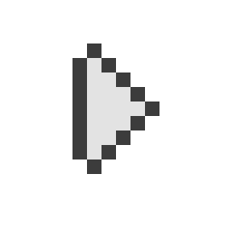

	

| `MY WORK` |
| --------- |
| <a href="https://github.com/crazywolf132/jungla">`Jungla`</a> 
<i>Schema-less GQL Alternative</i>
 |
| <a href="https://github.com/mani-language/Mani">`Máni`</a> 
<i>Super simple programming language</i>
 |
| <a href="https://github.com/crazywolf132/Asher.Ai">`Asher.Ai`</a> 
<i>Machine Learning Chatbot</i>
 |
| <a href="https://github.com/foxycorps/nanoevent">`Nano Event`</a> 
<i>Super small event emitter</i>
 |
| <a href="https://github.com/crazywolf132/tap">`TAP`</a> 
<i>Modern alternative to `touch`</i>
 |
| <a href="https://github.com/crazywolf132/fates">`Fates`</a> 
<i>Tame Your TypeScript Destiny!</i>
 |
| <a href="https://github.com/crazywolf132/fstr">`FSTR`</a> 
<i>Rust-like `println!` for Go with Superpowers</i>
 |
| <a href="https://github.com/crazywolf132/squish">`SQUISH`</a> 
<i>Zero-config TypeScript bundler</i>
 |
| <a href="https://github.com/crazywolf132/securefetch">`Secure Fetch`</a> 
<i>Secure AWS / Secret fetcher for Golang</i>
 |
| <a href="https://github.com/crazywolf132/goshed">`Go Shed`</a> 
<i>Go playground manager</i>
 |
